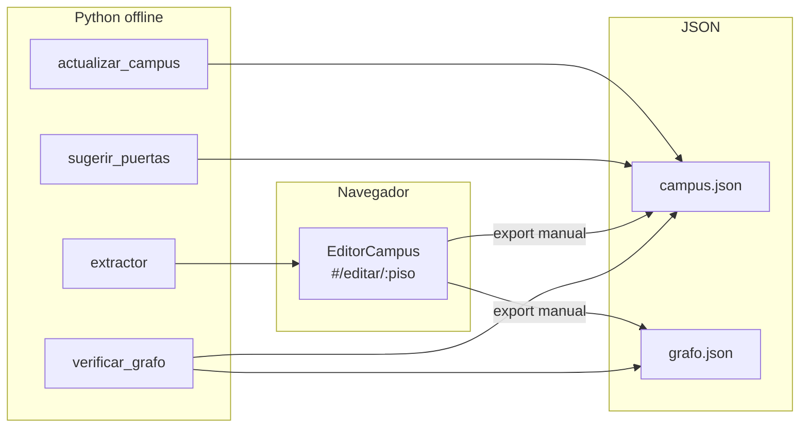

# ROADMAP — Editor de campus unificado

Hoja de ruta para **autoría y edición** de `campus.json` y `grafo.json`, con foco en integrar nuevos planos de piso.

> **Nota histórica:** el pivote a mapa indoor (Leaflet, BottomSheet, ruta sobre el mapa) está completado. Ver `MapaCampus.js`, `RutaPanel.js` y `App.js`.

---

## Visión

Un **editor único** en el navegador (`#/editar/:piso`) donde se calibra todo el contenido de un piso:

- Grafo de pasillos (nodos + aristas)
- Coordenadas de lugares (POIs)
- Puntos de puerta y spurs al corredor
- Validación visual (overlays generados por Python)

Los scripts Python siguen siendo el **gate de calidad en CI** (`verificar_grafo.py`); el editor los complementa, no los reemplaza.

---

## Decisiones técnicas

| Decisión | Elección | Razón |
|---|---|---|
| URL del editor | `#/editar/:piso` | Una sola pantalla; `#/anotar` y `#/calibrar` son alias |
| Coordenadas | % 0–100 (origen sup-izq, Y ↓) | Sin cambios; compatible con Leaflet vía `pctALatLng` |
| Fuentes de verdad | `campus.json` + `grafo.json` | El editor exporta fragmentos para pegar manualmente |
| Validación de paredes | Python + overlay PNG | No reimplementar CV en el browser |
| Registro de planos | `campus.json` + `scripts/planos_registry.py` | Eliminar dicts `PLANOS` hardcodeados |

---

## Estado actual de herramientas



| Herramienta | Qué edita | Acceso |
|---|---|---|
| **EditorCampus** (tabs Grafo / Lugares / Puertas / Validación) | Todo el piso | `#/editar/:piso` |
| `extractor` | Borrador automático de grafo | `python3 -m scripts.extractor --piso N` |
| `actualizar_campus.py` | `coord` desde círculos rojos en PNG | CLI |
| `sugerir_puertas.py` | Campo `puerta` en campus.json | CLI → import en tab Puertas |
| `verificar_grafo.py` | Validación + overlay PNG | CLI + CI |

**Alias deprecados:** `#/anotar/:piso` → tab Grafo · `#/calibrar/:piso` → tab Lugares

---

## Fases

### Fase 1 — Shell unificado ✦ *completada*

**Objetivo:** un componente, una URL, cero duplicación de layout.

- `EditorCampus.js` — tabs `grafo | lugares | puertas | validación`
- `PlanoEditorCanvas.js` — imagen + pan/zoom + cursor %
- Plano y etiqueta desde `campus.json` (`listarPisos`)
- Hash `#/editar/:piso` + aliases `#/anotar` / `#/calibrar`

**Archivos:** `src/components/EditorCampus.js`, `src/components/PlanoEditorCanvas.js`, `src/lib/planosRegistry.js`, `src/components/App.js`

**Criterio de hecho:** `#/editar/0` alterna entre tabs sin salir; aliases funcionan.

---

### Fase 2 — Export/import unificado ✦ *completada*

**Objetivo:** dejar de copiar/pegar JSON a ciegas.

- Exportar piso completo: `{ campus: { lugares }, grafo: { nodos, aristas } }`
- Botones: copiar campus / copiar grafo / descargar JSON
- Importar borrador del extractor (tab Grafo)
- Panel de resumen: N nodos, M aristas, K lugares, J puertas

**Archivos:** `src/lib/editorExport.js`

---

### Fase 3 — Modo puertas + preview de spurs ✦ *completada*

**Objetivo:** editar `puerta: { x, y, join? }` sin tocar JSON.

- Tab Puertas: spur visible desde centro/puerta al corredor
- Drag del punto puerta; selector de arista (`join`)
- Importar `scripts/preview/puertas-*.json` (salida de `sugerir_puertas.py`)
- Spurs tenues visibles en tab Grafo

**Archivos:** `src/lib/editorSpurs.js`

---

### Fase 4 — Validación integrada ✦ *completada*

**Objetivo:** ver feedback de `verificar_grafo.py` en el browser.

- Tab Validación: cargar overlay PNG (`scripts/preview/grafo-<piso>.png`) vía file picker
- Comando CLI visible para regenerar overlay
- `verificar_grafo.py --json` exporta reporte parseable

**CI:** sin cambios — `.github/workflows/ci.yml` + `verificar_grafo.py`

---

### Fase 5 — Flujo operativo: integrar un plano nuevo

Checklist end-to-end para cada piso nuevo:

#### 1. Preparar PNG

- Paredes oscuras (brillo &lt; 140), pasillos claros
- Círculos rojos en centroides de aulas (convención de `actualizar_campus.py`)
- Resolución recomendada: ~3000 px de ancho (proporción libre; coords son %)

#### 2. Registrar piso en campus.json

```json
{
  "numero": 3,
  "etiqueta": "3er Piso",
  "plano": "/planos/tercer-piso.png",
  "lugares": [
    { "id": "p3-101", "nombre": "Aula 101", "tipo": "aula", "coord": { "x": 50, "y": 50 } }
  ]
}
```

Copiar imagen a `public/planos/`.

#### 3. Coordenadas de lugares

```bash
python3 scripts/actualizar_campus.py          # detecta círculos rojos
# o calibrar en #/editar/N → tab Lugares
```

#### 4. Grafo de pasillos

```bash
python3 -m scripts.extractor --piso 3
# → scripts/preview/draft-tercer-piso.json
```

En `#/editar/3` → tab Grafo → **Importar borrador** → corregir con modos Agregar / Conectar / Cadena.

#### 5. Puertas (spurs)

```bash
python3 scripts/sugerir_puertas.py --piso 3
python3 scripts/sugerir_puertas.py --piso 3 --write   # escribe las OK
```

Revisar en tab Puertas; importar preview JSON si hace falta.

#### 6. Conexiones verticales

Editar manualmente `grafo.json → verticales`. Convención de IDs por piso:

| Piso | Prefijo nodo | Ejemplo ascensor |
|---|---|---|
| -1 | `s-n` | `s-ascensor` |
| 0 | `n` / `pb-` | `pb-ascensor` |
| 1 | `p1-n` | `p1-ascensor` |
| 2 | `p2-n` | `p2-ascensor` |
| N | `pN-n` | `pN-ascensor` |

#### 7. Validar

```bash
python3 scripts/verificar_grafo.py --solo-piso 3
python3 scripts/verificar_grafo.py --solo-piso 3 --json
pnpm test
```

Cargar overlay en tab Validación para revisión visual.

#### 8. Pegar en fuentes de verdad

Exportar desde `#/editar/N` → pegar en `campus.json` (lugares) y `grafo.json` (nodos/aristas del piso).

---

### Fase 6 — Infra de escalado (later)

- Editor visual de `verticales` (conectar ascensor/escalera entre pisos)
- Guardado directo a disco (requiere backend o extensión)
- Multi-edificio con selector de edificio
- SVG semántico generado (`generar_svg_plano.py` — no implementado aún)

---

## Comandos de referencia

```bash
pip install -r scripts/requirements.txt

# Borrador de grafo
python3 -m scripts.extractor --piso 0

# Coords desde círculos rojos
python3 scripts/actualizar_campus.py

# Puertas automáticas
python3 scripts/sugerir_puertas.py --piso -1 --write

# Validación (CI)
python3 scripts/verificar_grafo.py
python3 scripts/verificar_grafo.py --solo-piso 0 --json

# Dev server + editor
pnpm dev
# → http://localhost:5173/aulado/#/editar/0
```

---

## Fuera de alcance

- Multi-edificio en la UI de la app (datos soportan edificios; UI asume un edificio)
- Guardado automático a `src/data/*.json` desde el browser
- GPS / mapas exteriores
- Reimplementar detección de paredes en JavaScript
